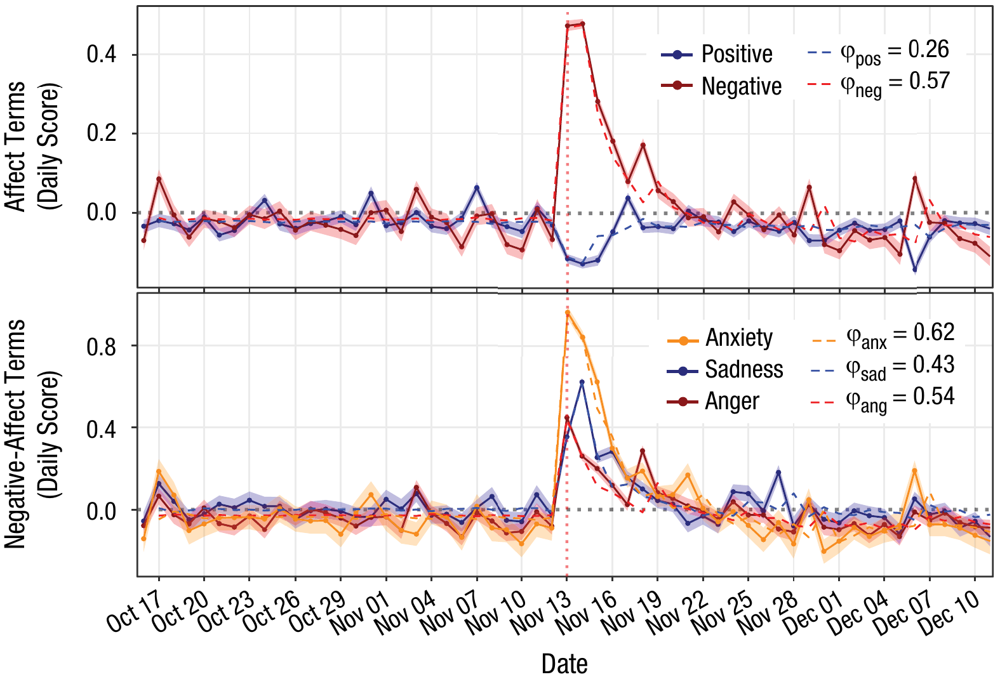
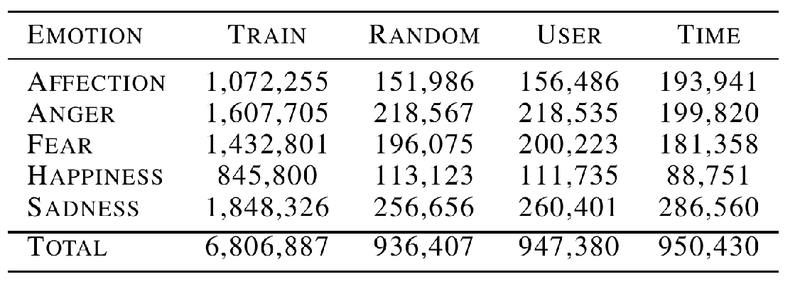
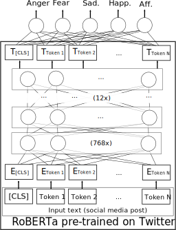

```{r xaringan-themer, include=FALSE, warning=FALSE}
#This block contains the theme configuration for the CSS lab slides style
library(xaringanthemer)
library(showtext)
style_mono_accent(
  base_color = "#5c5c5c",
  text_font_size = "1.5rem",
  header_font_google = google_font("Arial"),
  text_font_google   = google_font("Arial", "300", "300i"),
  code_font_google   = google_font("Fira Mono")
)
```

```{r setup, include=FALSE}
options(htmltools.dir.version = FALSE)
```


layout: true
<div class="my-footer"><span>David Garcia - Computational Social Science Lab, TU Graz</span></div> 


---
class:center
# About me

.pull-left[
```{r, echo=FALSE, out.width=270}
knitr::include_graphics("figures/Profile.jpg")
```
]

.pull-right[
<br>
Website: [dgarcia.eu](https://dgarcia.eu)

Twitter: [@dgarcia_eu](https://twitter.com/dgarcia_eu)

Github: [dgarcia-eu](https://github.com/dgarcia-eu)

Email: dgarcia@tugraz.at
]

Professor for Computational Behavioral and Social Sciences at TU Graz
<br>Faculty member of the Complexity Science Hub Vienna
<br>Group leader at the Medical University of Vienna

---

# The Computational Social Science Lab

<center>
```{r, echo=FALSE, out.width=650}

```

---
<center>
```{r, echo=FALSE, out.width=900}
knitr::include_graphics("figures/CSSinfo.png")
```
### Our aim is to understand human behavior and socio-technical phenomena in the digital society

---

## *Computational* in Computational Social Science
It can have three meanings:

- **Digital**<br> 
Based on large datasets of human behavior, for example produced by the Web and social media

- **Computerized**<br>
The quantitative analysis of data in an automated, tractable, repeatable, and extensible fashion

- **Generative**<br>
Application of data and results to design of agent-based models that explain complex social phenomena and motivate interventions

---


## Strengths and weaknesses of digital trace data

**Strengths:**
- Complementary approach to traditional survey and experimental methods
- Unprecedented scales and granularities
- Ease of data access, replicability of results
- Potentially high external validity, behavior in vivo

**Weaknesses:**
- Limits to internal validity: Lack of counterfactuals hinders causal analysis
- Self-selection bias: Who talks? Normalization issues: Who is silent?
- Data gatekeepers, Twitter as a model organism
- Intractability of black-box predictions and data piñatas

<div style="font-size:15pt">
[Sen et al. (2019). A Total Error Framework for Digital Traces of Humans.](https://arxiv.org/abs/1907.08228)<br>
[Olteanu et al. (2019). Social Data: Biases, Methodological Pitfalls, and Ethical Boundaries.](https://www.frontiersin.org/articles/10.3389/fdata.2019.00013/full)

---

# Avoid making a data piñata

```{r, echo=FALSE, out.width=1050}
knitr::include_graphics("figures/pinata.png")
```

---
## The Hype Cycle of Computational Social Science
<center>
```{r, echo=FALSE, out.width=900}
knitr::include_graphics("figures/Hype1.svg")
```
---
## The Hype Cycle of Computational Social Science
<center>
```{r, echo=FALSE, out.width=900}

```
---
## The Hype Cycle of Computational Social Science
<center>
```{r, echo=FALSE, out.width=900}
knitr::include_graphics("figures/Hype3.svg")
```
---

## Interdisciplinary Approach
<center>
```{r, echo=FALSE, out.width=900}

```
---

## Interdisciplinary Approach
<center>
```{r, echo=FALSE, out.width=900}

```

---
# Research Topics
```{r, echo=FALSE, out.width=950, fig.align='center'}
knitr::include_graphics("figures/Topics2.svg")
```
---

# Social Media Macroscopes

```{r, echo=FALSE, out.width=800, fig.align='center'}
knitr::include_graphics("figures/earth.svg")
```

---

layout: true
<div class="my-footer"><span>
<a href=https://arxiv.org/abs/2107.13236> Social media emotion macroscopes reflect emotional experiences in society at large. David Garcia, Max Pellert, Jana Lasser, Hannah Metzler. https://arxiv.org/abs/2107.13236 (2021)</a></span></div>

---

# Social Media Macroscopes of Emotions

.pull-left[
```{r, echo=FALSE, out.width=500}

``` 
<font size="5"> <a href="https://journals.sagepub.com/doi/full/10.1177/0956797619831964"> Collective Emotions and Social Resilience in the Digital Traces After a Terrorist Attack. Garcia & Rimé, Psychological Science (2019) </a>
</font>
]

.pull-right[
Problems with macroscopes:
1. Representation issues
2. Performative behavior
3. Measurement error and bias
4. Algorithmic confounding
5. Social media drift
6. Researcher degrees of freedom

- sentiment vs Gallup SWL </br> 
(Jaidka et al., PNAS, 2020)
- individual sentiment vs PANAS (Beasley et al., TIPS, 2016)
]


---

# Validating a UK emotion macroscope

```{r, echo=FALSE, out.width=1000, fig.align='center'}

```

---

# Sadness in Twitter and YouGov

```{r, echo=FALSE, out.width=1200, fig.align='center'}
knitr::include_graphics("figures/Sadness.svg")
```

- Similar results with dictionary-based and supervised (r~0.65)
---


# Summary of tests
<font size="5">

| Emotion (survey) | Twitter signal | $r_1$ (historical) |  $r_2$ (predicted) |
| --- | --- | --- | --- |
| Sad | LIWC sad | $0.688^{***} \quad [0.542, 0.794]$ | $0.672^{***} \quad [0.437, 0.821]$ |
| Sad | RoBERTa sad | $0.636^{***} \quad [0.472, 0.757]$ | $0.653^{***} \quad [0.408, 0.81]$ |
| Scared | LIWC anxiety | $0.78^{***} \quad [0.668, 0.857]$ | $0.471^{**} \quad [0.163, 0.695]$ |
| Scared | RoBERTa fear | $0.793^{***} \quad [0.687, 0.866]$ | $0.295^{\cdot} \quad [-0.042, 0.572]$ |
| Happy | LIWC positive | $0.298^{*} \quad [0.069, 0.497]$ | $0.043 (n.s.) \quad [-0.295, 0.371]$ |
| Happy | RoBERTa joy | $0.576^{***} \quad [0.396, 0.713]$ | $0.551^{***} \quad [0.267, 0.747]$ |
</font>
- Results improve with gender rescaling: demographic information improves representation in social media data
- Supervised classifier for happiness greatly outperforms dictionary-based
- Similar results in detrended cross-correlation analysis  
$\tiny ^{\cdot} p<0.1$   $\tiny ^{*} p<0.05$  $\tiny ^{**} p<0.01$  $\tiny ^{***} p<0.001$ 
---

# Exploring 12 emotional states
.pull-left[

- Time series of number sentences like "I am [emotion]" on Twitter

- Weak correlations happen for infrequent emotions in text

- Comparison: US weekly pre-election polls correlate with 0.66

- Arxiv preprint at https://arxiv.org/abs/2107.13236

]

.pull-right[
```{r, echo=FALSE, out.width=700}

```
]

---


## Online Media for Social Sensing of Emotions

```{r, echo=FALSE, out.width=570, fig.align='center'}
knitr::include_graphics("figures/socialsensing.svg")
```

- 3rd person and tweet emotion: +75% in anx. +62% in sad +35% in pos
- Repeating analysis in prediction period for users with >10,000 followers: 
  - correlation of sadness with survey is 0.79 and of anxiety with survey is 0.78
  - both significantly larger than for the full sample (t=2.4 and t=4.41, p<0.05)


---

layout: true
<div class="my-footer"><span>
Validating daily social media macroscopes of emotions. Max Pellert, Hannah Metzler, Michael Matzenberger, David Garcia. https://arxiv.org/abs/2108.07646 (2021)</span></div>

---

## Replication with an Austrian macroscope

.pull-left[
- 20-day emotion survey in derstandard.at (N=268,128)
- Text from Der Standard forum and Austrian tweets
- Supervised sentiment model (GS)
- High correlation of daily sentiment between survey and both social media text sources
- Good correlation between inter-day changes (0.73)
]
.pull-right[
```{r, echo=FALSE, out.width=800}
knitr::include_graphics("figures/DS1.svg")
```
]

- Conceptual validation: similar correlation with new COVID-19 cases (-0.55)

---

layout: true
<div class="my-footer"><span>David Garcia - Overcoming the methodological deficits of Computational Social Science</span></div> 

---

## LEIA: Training with self-reported emotion labels

.pull-left[

- The problem of sentiment analysis: Writer versus reader emotions

- LEIA: Language Embeddings for the Identification of Affect

- Trained with 6.8M self-annotated Vent posts

```{r, echo=FALSE, out.width=500}

```
]

.pull-right[
```{r, echo=FALSE, out.width=350, fig.align='center'}

```
]
---

### Outperforming humans in social media emotion detection?

- **Transfer learning:** good results answering the International Survey on Emotion Antecedents and Reactions (F1 between 0.73 and 0.86)
- **Pilot:** Outperforms Mechanical Turkers (high approval rate, US).  
McNemar test of LEIA vs majority vote ( $\chi^2=74$, p<0.001).
- **Current work:** testing versus native-speaking psychology students


| Emotion | LEIA  | Individual Rater | Majority Vote |
| --- | --- | --- | --- |
| Affection  | **70.5  [64.2, 76.8]** |  41.0 [36.0, 46.2] | 53.5  [46.6, 60.5] |
| Anger | **68.0 [61.3, 74.4]** | 40.0  [34.7, 45.3]  |  34.4 [28.0, 41.1] |
| Fear | **65.5 [58.7, 72.0]** | 33.1 [28.3, 38.0] | 41.5  [34.7, 48.3] |
| Happiness  | **81.1 [75.3, 86.2]** | 63.2  [57.7, 68.5] | 65.5 [58.8, 72.1] |
| Sadness | **65.0 [58.3, 71.5]** | 49.0 [43.7, 54.1] | 47.0  [40.0, 53.9] |
| Average | **70.0 [67.2, 72.8]** | 45.2 [42.9, 47.6] | 48.4  [45.3, 51.5] |


---

# Summary

- Computational Social Science needs to overcome its methodological deficits

- Studying emotions on social media: macroscopes to monitor society

- Evaluation of Twitter emotion macroscopes in the UK and Austria

- Social sensing as a new source to gather social data from text

- From reader to writer's emotions in social media: LEIA

- Combining methods from computer science and the social sciences to inform research on emotions, polarization, information disorder, and complex privacy

.center[**More at: [www.dgarcia.eu](https://dgarcia.eu) and [@dgarcia_eu](https://twitter.com/dgarcia_eu)**  
**Thanks for listening!**
]